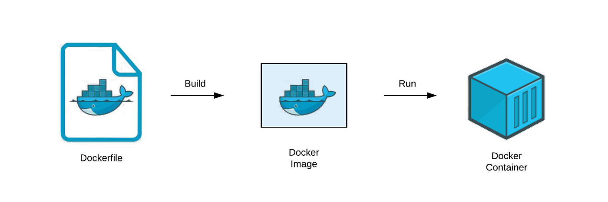
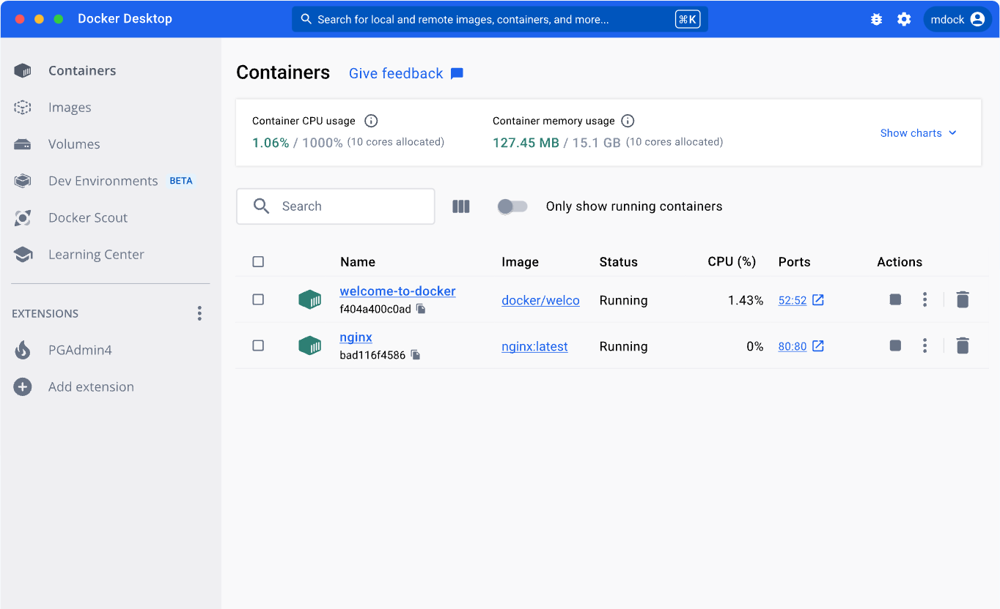
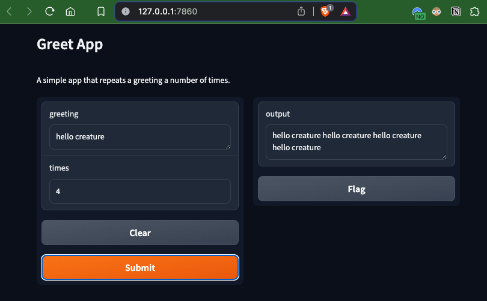
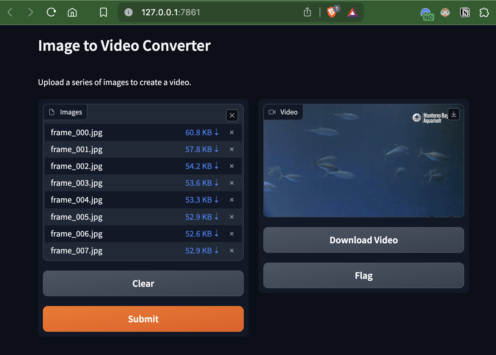

# Containerization with Docker 
2024-04-17 <br>
[Per Halvorsen](https://perhalvorsen.com) | [GitHub](https://github.com/pmhalvor/ocean-species-identification) | [LinkedIn](https://www.linkedin.com/in/pmhalvor/)

---

## Introduction
In this note, we want to explore the basics of containerization with Docker.
To start the note off, some background terminology needed to understand these technologies is covered, basically summarizing the [Docker overview](https://docs.docker.com/get-started/overview/). 
From here, we introduce a small example project and go through the necessary steps to build custom images suited specifically to the needs of the project.
Iterating on these simpler images, we then wrap a simplified machine learning model with a GUI into a container and show how to run and interact with this locally. 
The note rounds off with some tips on how such a model would be deployed to a server. 

# Outline 
**[Background](#Background)**
* [Problem definition](#Problem)
    * Scope 
    * Fields 
* [Best solution](#Solution)
    * The basic idea of containerization
    * Runnable anywhere
    * Opportunities: local development runnable on the cloud, or easily portable app, like a tool-box. 
* [Terminology](#Terminology)
    * Essential: images, containers, Dockerfile, build, host machine
    * Additional: registry, repository, volume, network
* [Architecture](#Architecture)
    * Docker client
    * Docker daemon
    * Diagrams from various tutorials or draw our own
* [Local requirements](#Local-requirements)
    * Docker Desktop
    * Docker Hub account
    * Installation

**[Tutorial](#Tutorial)**
* [Basic starter commands](#Basic-commands)
    * Browsing images 
    * Pushing and pulling 
    * Run examples 
    * Shell access: Python and bash
    * Build custom images

* [A simple example](#A-simple-example)
    * Gradio app
    * Expose a port
    * Pip install a library 
    * Save output to a file
    
* [Our img2vid example](#Our-img2vid-example)
    * Use the img2vid.py file to start
    * Bake into image and run as executable 
    * Bake into a Gradio app, and run locally
<!-- * (Attempt) Run from a server, or just mention and say “More on that later” -->

<!-- A template project
* Bare bones
* Scripts to build project  -->
<!-- 
Our complex example
* Prepare the image 
    * All repos necessary 
    * All configs necessary  -->

**[Conclusion](#Conclusion)**
* Recap
    * Images, containers, running, building
    * Volumes, port exposure, isolated environments
    * Gradio app, img2vid example
    * Installing dependencies, uploading and downloading files
* Future work
    * Deploy to server
    * More complex scenarios
        * Lightweight images using multistage build or alpine
        * More complex models: multiple-stage pipelines or multiple models
        * Running multiple containers using docker-compose

# Background

## Problem
In software development, it is often necessary to run code on different machines, with different operating systems, and with different dependency versions.
The underlying code is the same, but the environment in which it runs can vary significantly.
Some may argue that well-written code should be executable on any machine, but in reality, things are not always that simple.

Often, systems require specific drivers, modules, or libraries to run, or the code is written in a language that is not natively supported by the target machine.
[OS-level virtualization](https://en.wikipedia.org/wiki/Operating-system-level_virtualization) makes it possible to run multiple (even nested) operating systems on a single physical machine, providing the essential first steps towards solving the problem of cross-platform collaboration. 

However, even with virtual machines, the code still needs to be packaged and shipped with all its dependencies.
Dependency management within these systems can be a hassle, especially as outdated libraries become vulnerable to security threats, or as new versions of libraries break compatibility with existing code.

Many Python projects nowadays make use of package managers like [pip](https://pypi.org/project/pip/) or [conda](https://docs.conda.io/en/latest/) together with a `requirements.txt` file to manage and specify the exact versions of needed dependencies. 
Similar set-ups exist for other languages too, like [maven](https://maven.apache.org/) for Java/Scala or [cargo](https://doc.rust-lang.org/cargo/) for Rust, but these are not always enough to ensure that the code runs as expected on all machines.
Even with these package managers, the target machine would still need to have the correct version of the language runtime installed, which introduces another potential source of conflicts.

Transitioning from technical, project development to high-level, product management, the necessity for code to run the same way on different machines becomes even more critical.
Whether the product needs to be deployed to a server with a different OS than the development team's local machines or the product is to be handed over as an executable program to a client, the code should always run as expected, without any issues.

Now, what if I told you there exists a tool that can solve all these problems and more? 

<!-- Drumroll gif -->


## Solution
To solve this problem, we need a way to package code and its dependencies into a single, self-contained unit that can be run anywhere.
This is where containerization comes in.

An application can be packaged into a container, which is a portable environment that contains everything needed to properly execute the application.
This includes the code, runtime, system tools, libraries, and settings.
Since containers are isolated environments, they can run on any machine that supports containerization technology, without compatibility issues or dependencies.

# Docker 

<a href="https://www.docker.com/">

</a>
<br >

Released in 2013, [Docker](https://www.docker.com/) is an open-source platform that enables developers to build, ship, and run applications inside containers.
It is the most popular containerization technology on the market, and it can be used to serve, share, and manage a range of applications, from simple scripts to complex microservices architectures.
To understand how Docker works, it is necessary to learn the terminology describing [Docker objects](https://docs.docker.com/get-started/overview/#docker-objects).


## Terminology


**Essential**
(Need to know)

An **_image_** is a read-only template that contains the application code, runtime, libraries, and dependencies. Think of this as the filesystem snapshot, describing how the inside of the container should look.

A **_container_** is a running instance of an image, with its own filesystem, network, and process space. It can serve or execute whatever task the image was built for. Containers are isolated from each other and the host machine, making them secure and portable, though they can be configured to communicate with each other and the host machine through networks and volumes.

The **_Dockerfile_** is a text file that contains instructions for building a Docker image. Each line represents a "layer" in the image and is a step in the process of building the final image. Arguments here are typically commands that would be run in a terminal to set up the environment for the application: defining environment variables, installs, cloning repositories, et cetera.

A **_build_** is the process of creating a Docker image from a Dockerfile. This involves downloading the necessary files, installing dependencies, and configuring the image according to the instructions in the Dockerfile.

The **_host machine_** is the machine on which Docker is installed and running. This is where the Docker daemon is running, managing containers, images, networks, and volumes.
If you are following along and running the example commands in this note, your local machine is considered the host machine.


<div style="text-align:center;">Source: <i>Understand Dockerfile by Rocky Chen (<a href="https://medium.com/swlh/understand-dockerfile-dd11746ed183">Medium</a>)</i></div>
<br>

**Additional**
(Good to know)

A **registry** is a library of different Docker images, such as [Docker Hub](https://hub.docker.com/), where public images are stored and shared. Docker Hub is the default registry for Docker images, and it is where you can find official images for many popular software packages, like databases, web servers, and programming languages. Private companies may maintain private registries, where internal images are managed and stored for proprietary or security reasons.

A **repository** is a collection of related Docker images (likely from the same project), tagged with version numbers. As updates are made to the project, new images including the updates are built and released under new version tags. This helps to keep track of changes and maintain a history of the project, in addition to dependency management. 

A **volume** is a persistent data storage mechanism for containers. Since containers are stateless (i.e. any data generated when running the container is deleted on container exit), volumes provide a way to store and share data between containers and the host machine. This is useful for storing configuration files, logs, or databases that need to persist across container restarts.

**Networks** are communication channels between containers. Different network types can be created to allow containers to communicate with each other, with the host machine, or with the rest of the internet. This is useful for creating microservices architectures, where different containers handle different parts of an application and need to communicate with each other.


## Architecture 
Docker containers are similar to virtual machines, but they are more lightweight and faster to start.
They share the host operating system's kernel and run as a nested process, isolated from other containers and the host system, making them more efficient than full virtual machines.

With the Docker client (`docker`), containers can be easily built, run, shared, and deleted, making them ideal for development, testing, and deployment.
This CLI is the fastest way to interact with Docker, but there are also GUIs available, like [Docker Desktop](https://www.docker.com/products/docker-desktop), which provides a graphical interface for managing containers, images, networks, and volumes.
Docker Desktop is usually bundled with the Docker engine, which is the underlying software that runs and manages containers on the host machine.


The Docker client communicates with the Docker daemon (`dockerd`), which is responsible for managing containers, images, networks, and volumes on the host machine.
The daemon listens for API requests and manages the container lifecycle, including starting, stopping, and deleting containers, as well as building, pushing, and pulling images.


<div style="text-align:center;"><i>For more on its architecture see the <a href="https://docs.docker.com/get-started/overview/#docker-architecture">Docker overview</a>.</i></div>


## Local requirements
To get started with Docker, you need to have [Docker Desktop](https://www.docker.com/products/docker-desktop/) installed on your local machine.
The tool is free for teams under 250 or less than $10 million in annual revenue, and it is available for Windows, Mac, and Linux operating systems.

In addition to the Docker Desktop, it could be useful to have a [Docker Hub](https://hub.docker.com/) account.
This is a cloud-based registry where you can store and share Docker images, either publicly or privately.
It is also a place to find official images for popular software packages, as well as community-contributed images for a wide range of applications.
If you only plan on using others' images, then you don't need an account. 
However, if you are going to want to push your own images to the registry, making them openly available to others, then you will need an account.

<!-- Local login? -->
If you've downloaded Docker Desktop, you should be able to run the `docker` command in your terminal.
You can easily log in to your Docker Hub account by running `docker login` and entering your credentials.

```
$ docker login

Login with your Docker ID to push and pull images from Docker Hub. If you don't have a Docker ID, head over to https://hub.docker.com to create one.
Username: your-docker-id
Password: **************
```

This will allow you to push and pull images from the registry, as well as manage your account settings.
Alternatively, you can log in through the Docker Desktop GUI.




## Basic commands 

### Browsing images

To see what images are available on your local machine, you can run the following command:

```
$ docker images
```

This will list all the images that have been downloaded or built on your machine.
If you've just downloaded Docker Desktop, you probably won't have any images yet.

Let's head over to the [Docker Hub](https://hub.docker.com/) and find an image to download.

### Pulling and pushing images
<!-- Download pytorch image -->
Since we have been working with Python 3.11 for other parts of this series, let's pull an official Python image from [Docker Hub](https://hub.docker.com/_/python). 
For easy compatibility, we will pull the `bullseye` tag, which is based on Debian 11. 
If we were looking for a smaller image, we could have chosen the `slim` tag, which is based on Debian 11 slim, or better yet the `alpine` tag, which is typically used for lightweight images.

```
$ docker pull python:3.11-bullseye

3.11.9-bullseye: Pulling from library/python
197347a07d5f: Pull complete
31e3f4a56068: Pull complete
21337b8832e1: Pull complete
191dceb3c577: Pull complete
e2c5613371f9: Pull complete
82bfb246d40b: Pull complete
a8322d013370: Pull complete
16945623aa37: Pull complete
Digest: sha256:8d1337affcd43dd64c072a0c22a731255326cec3683ff0ef616d9041d364aa1d
Status: Downloaded newer image for python:3.11.9-bullseye
docker.io/library/python:3.11.9-bullseye
```

Up until this point, we've been talking about containers as some application or executable that we want to run.
But this image is just a Python environment, not an application.
There's no program in it yet, just an empty filesystem with Python installed.
We can run this image as a container, and see what happens.

```bash
$ docker run python:3.11.9-bullseye
```

Nothing happens. 


<br>

That's because we didn't tell the container to do anything.
Let's try running Python instead.
To start, we'll just check the version. 

```bash
$ docker run python:3.11.9-bullseye python --version
Python 3.11.9
```

Great, but does this mean we can run a local Python script using the container?
Let's create a local Python file and test it out. 
```bash
$ echo "greet = lambda x,n: print(x*n); greet('hello world ', 1)" > greet.py
$ docker run python:3.11.9-bullseye python greet.py

python: can't open file '//greet.py': [Errno 2] No such file or directory
```
This won't work because the container doesn't have access to the local filesystem, hence the _isolated environments_ mentioned earlier.
The container can only see inside its own filesystem, by default, but can be given access to the host filesystem using volumes. 
More on that later. 

Let's instead stick to the basics, and try to start a Python shell inside the container.

```python
$ docker run --rm -it python:3.11.9-bullseye python

Python 3.11.9 (main, Apr 10 2024, 11:55:03) [GCC 10.2.1 20210110] on linux
Type "help", "copyright", "credits" or "license" for more information.
>>> import os
>>> os.listdir()
['srv', 'boot', 'sys', 'lib', 'var', 'etc', 'root', 'tmp', 'mnt', 'run', 'proc', 'sbin', 'home', 'opt', 'bin', 'media', 'usr', 'dev', '.dockerenv']
```

Now we can see the internal files of the container.
If we are using another Linux-based image, maybe one without a Python installation, we could also just start a bash shell inside the container. 
This gives us the ability to check what is installed in the container, and potentially install new packages. 

```bash
$ docker run --rm -it debian:bullseye bash

root@f5cz1337a85e:/# ls

bin  boot  dev	etc  home  lib	media  mnt  opt  proc  root  run  sbin	srv  sys  tmp  usr  var
```

In our container, we can see that Python is installed, along with `git`, `curl`, `apt-get`, and other basic utilities that come with a Debian distribution. 


### Build custom images
So, the question then is, how can we then run a container with our own code inside? 
This is where the `Dockerfile` comes in.


<div style="text-align:center;">Source: <i>Understand Dockerfile by Rocky Chen (<a href="https://medium.com/swlh/understand-dockerfile-dd11746ed183">Medium</a>)</i></div>
<br>

Dockerfiles are text files that contain a series of instructions for building a Docker image.
They typically start with a `FROM` instruction, which specifies the base image to build upon.
This can be an official image from Docker Hub, like `python:3.11.9-bullseye`, or a custom image that you've built yourself.
There are no limits to how many instructions you can include in a Dockerfile, but it is recommended to keep them as minimal as possible to reduce the image size and build time.

It's typically a good idea to start with a base image that already has the necessary tools and libraries installed, and then add your own code and dependencies on top of that.
If your team typically uses the same preprocessing steps or other common tasks, you could also consider creating a base image that includes these steps, and then build your application on top of that.

Here's an example of a simple Dockerfile that builds an image with Python 3.11.9 installed and our Python script `greet.py` made earlier, that prints "hello world" a few times.

```Dockerfile
# Use the official Python image as a parent image
FROM python:3.11.9-bullseye

# Set the working directory in the container
WORKDIR /app

# Copy our file into the container at /app
COPY greet.py /app

# Run greet.py when the container launches
CMD ["python", "greet.py"]
```

To build the image, we can run the following command in the same directory as the `Dockerfile` and `greet.py` file:

```bash
$ docker build -t greet-app:1 .
```

This will create a new image called `greet-app` based on the instructions in the `Dockerfile`.
The image is currently only available on your local machine, but you can push it to Docker Hub or another registry to make it available to others.
Before we do that though, let's check it runs as expected.

```bash
$ docker run greet-app:1

hello world 
```

Sweet!
We can now start seeing the power of Docker, as we can run this container on any machine that has Docker installed, and it will run the same way every time.

Let's now increase the complexity a bit more, by adding a Python script that takes in arguments. 
We can make some adjustments to our `greet.py` file from earlier, and call the new file `greet2.py`:

```python
def greet(x, n):
    print(x*n)

if __name__ == "__main__":
    import sys
    greet(sys.argv[1], int(sys.argv[2]))
```

We will need to revisit our `Dockerfile` to include the new script and configure it to allow arguments to be passed when running the container. 
The latter can be done using the [`ENTRYPOINT`](https://docs.docker.com/reference/dockerfile/#entrypoint) instruction, which specifies the default command to run when the container starts.


```Dockerfile
# Use the official Python image as a parent image
FROM python:3.11.9-bullseye

# Set the working directory in the container
WORKDIR /app

# Copy the script into the container at /app
COPY greet2.py /app

# Run greet2.py when the container launches with ENTRYPOINT
ENTRYPOINT ["python", "greet2.py"]
```

Running this should give:
```bash
$ docker build -t greet-app:2 .
$ docker run greet2-app "hello earthling " 2

hello earthling hello earthling 
```
Awesome! This is the same result we would expect if we ran the script locally.

Now, we would like the container to be able to read and/or write files _on our local machine_.
Remember that the container is isolated and stateless, so if we generate and store a file within the container, the data will be lost when the container exits at the end of the run call (by default).
We need some way to persist the data so that it can be accessed after the container has stopped. Any ideas? ([hint](https://docs.docker.com/storage/volumes/))

Let's start by tweaking our Python script to write the output to a file, instead of printing it to the console.
We can also add print statements to show the internal working directory and the files present in the container.

We'll call this one `greet3.py`: 

```python
import os, sys

OUTPUT_DIR = os.environ.get("OUTPUT_DIR", ".")


def greet(x, n):
    return x*n


def store_greeting(x, n, output_file, ext="txt"):
    greeting = greet(x, n)
    with open(f"{OUTPUT_DIR}/{output_file}.{ext}", "w") as f:
        f.write(greeting)

    return greeting


if __name__ == "__main__":
    # Show the current working directory
    print("Current working directory:", os.getcwd())
    print(os.listdir(), "\n")

    # Output directory store as environment variable
    print(f"Output directory: {OUTPUT_DIR}")
    print(os.listdir(OUTPUT_DIR), "\n")

    # Print any previously stored greetings
    for file in os.listdir(OUTPUT_DIR):
        if file.endswith(".txt"):
            with open(os.path.join(OUTPUT_DIR, file), "r") as f:
                print(file)
                print(f.read(), "\n")

    # Write the greeting to a file
    greeting = store_greeting(
        sys.argv[1],                                    # Greeting
        int(sys.argv[2]),                               # Number of times to repeat
        sys.argv[3] if len(sys.argv) > 3 else "output"  # Output file name
    )

    print(greeting)
```

To allow the container to persist data after shutdown and/or write to the host filesystem, we need to configure a [volume](https://docs.docker.com/storage/volumes/).
Volumes help share data between the host machine and the container.
We update our Dockerfile as such:

```Dockerfile
# Use the official Python image as a parent image
FROM python:3.11.9-bullseye

# Set the working directory in the container
WORKDIR /app

# Set local enivorment variable for output dir 
ENV OUTPUT_DIR /output

# Copy the script into the container at /app
COPY greet3.py /app

# Run greet3.py when the container launches with ENTRYPOINT
ENTRYPOINT ["python", "greet3.py"]

# Configure volume to output dir
RUN mkdir $OUTPUT_DIR
VOLUME $OUTPUT_DIR
```

Notice the `VOLUME` instruction used to create a volume at the `/output` directory inside the container.
We could have chosen the working directory the code is running from or any other directory that we want to persist data in.

With a designated destination for outputs, we now need to tell Docker how we want to mount this volume to the host machine.
Mounting basically means that we want to connect the volume in the container to a destination on our host machine.
Any data written to the volume in the container is saved to the host machine and any data at the destination on the host machine is accessible to the container.

To mount a volume at run-time, we need to use the `-v` flag, specifying the name or path on the host machine where the data should be stored.
For example, `-v /path/on/host:/path/in/container` would mount the `/path/in/container` directory in the container to the `/path/on/host` directory on the host machine.

To make things easy, we will mount our container to a new folder `output/` in the current working directory on our host machine. 

```bash
$ mkdir output
$ docker build -t greet-app:3 .
$ docker run -v $(pwd)/output:/output greet-app:3 "hello alien " 3 "local_output"
$ cat local_output.txt

hello alien hello alien hello alien
```

The behavior of mounting at run-time is useful when we want to build images that are to be run on unknown host machines, (for example, wrapping a model pipeline in a container for a client to run on their local machines).


We could have also created a named volume and used that instead of the local directory.
This is useful when we want to share data between multiple containers, or when managing large projects with locally cloned repositories and separate large datasets that we'd want to avoid pushing to GitHub.
For more on the many ways of configuring volumes, refer to the [Docker documentation](https://docs.docker.com/storage/volumes/).

<br>


With these basic functionalities in place, we can now move on to more complex tasks, involving external libraries and port exposures.

# A simple example
Let's expand on the loose example above to a simple [Gradio](https://www.gradio.app/) app that mimics our local greet script, but with a GUI accessible via a web browser.
This will allow us to explore how to expose a port in a Docker container, install a library, and save outputs to a file.

Gradio is a Python library that allows you to create web interfaces for your machine-learning models, data processing pipelines, or any other Python function.
It is easy to use and requires minimal code to create a fully functional web app that can be shared with others.

To create a Gradio app locally, we need to install the `gradio` library and write a Python script that defines the app's interface and functionality. Let's adapt our previous `greet3.py` script to work with Gradio.

```python
import gradio as gr
import os 

SERVER_NAME = os.environ.get("SERVER_NAME", "127.0.0.1")
SERVER_PORT = int(os.environ.get("SERVER_PORT", "7860"))

def greet(x, n):
    return (x+" ")*n

def greet_interface(greeting: str, times: int):
    return greet(greeting, times)

interface = gr.Interface(
    fn=greet_interface,
    inputs=["text", "number"],
    outputs="text",
    title="Greet App",
    description="A simple app that repeats a greeting a number of times."
)

if __name__ == "__main__":
    interface.launch(server_name=SERVER_NAME, server_port=SERVER_PORT)
```
We defined local environment variables for the server name and port, which we will revisit when building our Docker image later. 

We then ensure `gradio` is installed then run the script:

```bash
$ pip install gradio
$ python greet_gradio.py

Running on local URL:  http://127.0.0.1:7860

To create a public link, set `share=True` in `launch()`.
```

This will start a local server that hosts the Gradio app, accessible at the given URL.
Open a browser and head to the url:



With that working locally, let's repeat all these steps in a Docker container.
Be sure to close the server using `Ctrl+C` before proceeding.

First, we need to update our `Dockerfile` to include the `gradio` library and expose a port for the web interface.

```Dockerfile
# Use the official Python image as a parent image
FROM python:3.11.9-bullseye

# Set the working directory in the container
WORKDIR /app

# Set local enivorment variable for server name and port
ENV SERVER_NAME "0.0.0.0"
ENV SERVER_PORT 7860

# Copy the script into the container at /app
COPY greet_gradio.py /app

# Install the necessary dependencies
RUN pip install gradio

# Expose the port for the Gradio app
EXPOSE $SERVER_PORT

# Run the Gradio app when the container launches
CMD ["python", "greet_gradio.py"]
```

Notice the `EXPOSE` instruction, which tells Docker to expose port 7860 on the container.
This is the port that the Gradio app will run on, and we need to map this port to a port on the host machine when running the container.

We also set the `SERVER_NAME` and `SERVER_PORT` environment variables to allow for easy configuration of the server name and port.
To ensure the server is accessible from the host machine, the server name for the Gradio app must be `0.0.0.0`.

To run the container with the Gradio app, we need to use the `-p` flag to map the container port to a port on the host machine.

```bash
$ docker build -t greet-app:gradio-1 .
$ docker run -p 7860:7860 --name greet-gradio-container greet-app:gradio-1
```

The build time will take a bit longer now since the `gradio` library now has to be installed into the image. 
We also now provide the `--name` flag to give the container a name, which makes it easier to manage the container through commands like `docker inspect`, `docker stop`, or `docker rm`.

If no error messages appear, the container should be running the Gradio app.
Go to the same address as before and see if the app is accessible from the browser.

Ensure it is actually running by killing the container and trying to access the URL again.

I encourage you to play around with the app and container here, running on different local ports, or even multiple containers at the same time.
Purposely breaking and fixing the app is a great way to learn how Docker containers work and how they can be used to run different applications in isolation.

<br>

When you are ready, we can move on to the next section, where we will build a dockerized Gradio app that converts a series of images into a video.


# Our img2vid example
For the rest of this note, we will assume we are working from the root directory of the [ocean-species-identification](https://github.com/pmhalvor/ocean-species-identification) repository (unless otherwise mentioned).
In [docker/](https://github.com/pmhalvor/ocean-species-identification/tree/master/docker), you can also find all of the other files created above. 

## img2vid as an executable Docker app
As a part of the exploration and discovery phase for a previous blog post on [multiple object tracking](https://perhalvorsen.com/media/notes/multiple_object_tracking.html), I created a small Python script that takes a series of images and converts them into a video, using the `opencv` library.
You can find the script at [src/tools/img2vid.py](https://github.com/pmhalvor/ocean-species-identification/blob/master/src/tools/img2vid.py).


This file can be used as such:
```bash
$ python3 src/tools/img2vid.py <image_directory> <output_name>
```
We can use some example data found locally in this repository at [`data/example/mba`](https://github.com/pmhalvor/ocean-species-identification/tree/master/data/example) to test the script. 
(Note: this expects `opencv-python` to be installed in your local environment.)

```bash
$ python3 src/tools/img2video.py "data/example/mba/" "aquarium.mp4"
```
The output should look something like this:
<!-- insert gif when ready  -->

<br>

To make this script more accessible, we can bake it into a Docker image that runs the script as an executable, and another that wraps the script in a Gradio app, allowing users to upload images and download the output video.

Containerizing the app makes it more accessible to users who don't have `opencv` and all its machine-specific dependencies installed on their local devices, or even Python for that matter.
They can simply run the Docker container with the input files and get the output video.

Let's start by creating a Dockerfile that builds an image with the `img2vid.py` script and the necessary dependencies installed.

```Dockerfile
# Use the official Python image as a parent image
FROM python:3.11.9-bullseye

# Set the working directory in the container
WORKDIR /app

# Set local enivorment variable for input and output dir
ENV INPUT_DIR /input
ENV OUTPUT_DIR /output

# Copy the script into the container at /app
COPY src/tools/img2vid.py /app

# Install the necessary dependencies for opencv
RUN apt-get update && apt-get install ffmpeg libsm6 libxext6  -y
RUN pip install opencv-python

# Run img2vid.py when the container launches
ENTRYPOINT ["python", "img2vid.py"]
```
Notice the path provided to the `img2vid.py` script, which assumes the script is located at `src/tools/img2vid.py` in the repository.
The Dockerfile is expected to be built from the root directory of the repository, where the `src/` directory is located.

We also specify the `INPUT_DIR` and `OUTPUT_DIR` environment variables to allow for easy configuration of the input and output directories. This will help keep our volume mounts clear and concise when running the container.

Finally, we install the necessary dependencies for `opencv` using the `apt-get` package manager. Many of these dependencies come built-in on Mac and Windows machines but are not included in the base Python image we are using.


```bash
$ docker build -t img2vid-app:exe -f docker/Dockerfile .
```

We can now run the container with the input files and get the output video.

```bash
$ docker run \
    -v $(pwd)/data/example/:/input \
    -v $(pwd)/docker/output/:/output \
    img2vid-app:exe mba aquarium-docker.mp4
```

To clarify, we mount the `data/example/` directory to the `/input` directory inside the container, and the `docker/output/` directory to the `/output` directory inside the container.
This way, the container can access the input files and write the output video to the correct destinations on the host machine.

If everything works as expected, you should see the output video in the `docker/output/` directory on your host machine.

```bash
$ open docker/output/aquarium-docker.mp4
```


Great! We now have a Docker image that works as an executable app. 
It can convert a series of images into a video, without the need for `opencv` or Python to be installed on the host machine.


## img2vid as a Gradio app
To make the app more accessible and user-friendly, we can wrap the `img2vid.py` script in a Gradio app that allows users to upload images and download the output video.

We will need to write a new wrapper script that uses the `gradio` library to create the interface and call the `img2vid.py` script with the uploaded files.
We'll call it `img2vid_gradio.py`.

```python
import gradio as gr
import os
import shutil

# only runnable in Docker container since img2vid is not in this directory
from img2vid import convert as img2vid_convert

# img2vid related
INPUT_DIR = os.environ.get("INPUT_DIR", ".")
OUTPUT_DIR = os.environ.get("OUTPUT_DIR", ".")
OUTPUT_PATH = os.path.join(OUTPUT_DIR, "output.mp4")

# gradio related
SERVER_NAME = os.environ.get("SERVER_NAME", "127.0.0.1")
SERVER_PORT = int(os.environ.get("SERVER_PORT", "7861"))


def prep_input_dir():
    # create dir and remove any files currently here
    img_dir = os.path.join(INPUT_DIR, "images")
    os.makedirs(img_dir, exist_ok=True)
    for file in os.listdir(img_dir):
        os.remove(os.path.join(img_dir, file))

    # prep output dir
    os.makedirs(OUTPUT_DIR, exist_ok=True)   
    
    return img_dir


def copy_files(files, dest_dir):
    for file in files:
        shutil.copy(file, dest_dir)
    

def img2vid_interface(files):
    img_dir = prep_input_dir()
    copy_files(files, img_dir)

    # Convert images to video
    img2vid_convert(img_dir, OUTPUT_PATH)

    return [
        gr.Video(label="Video", value=OUTPUT_PATH),
        gr.DownloadButton(label="Download Video", value=OUTPUT_PATH)
    ]


interface = gr.Interface(
    fn=img2vid_interface,
    inputs=gr.Files(label="Images", file_count="multiple"),
    outputs=[
        "video",
        gr.DownloadButton(),
    ],
    title="Image to Video Converter",
    description="Upload a series of images to create a video."
)


if __name__ == "__main__":
    interface.launch(server_name=SERVER_NAME, server_port=SERVER_PORT)
```

This script defines the interface for the Gradio app, allowing users to upload multiple image files and download the output video.
To avoid messing with the temporary Gradio files, we copy the uploaded images to an `input/` directory, similar to earlier, then run `img2vid_convert` as usual. 

We also set the `INPUT_DIR` and `OUTPUT_DIR` environment variables to allow for easy configuration of the input and output directories.

Let's build our Dockerfile for the img2vid Gradio app.

```Dockerfile
# Use the official Python image as a parent image
FROM python:3.11.9-bullseye

# Set the working directory in the container
WORKDIR /app

# Set local enivorment variable for input and output dir
ENV INPUT_DIR /input
ENV OUTPUT_DIR /output

# Set local enivorment variable for server name and port
ENV SERVER_NAME "0.0.0.0"
ENV SERVER_PORT 7861

# Copy the scripts into the container at /app
COPY src/tools/img2vid.py /app
COPY src/tools/img2vid_gradio.py /app

# Install the necessary dependencies for opencv and gradio
RUN apt-get update && apt-get install ffmpeg libsm6 libxext6  -y
RUN pip install opencv-python gradio

# Run img2vid_gradio.py when the container launches
CMD ["python", "img2vid_gradio.py"]
```

Now we can build and run:
    
```bash
$ docker build -t img2vid-app:gradio -f docker/Dockerfile .
$ docker run -p 7861:7861 img2vid-app:gradio
```

If all goes well, you should now be able to interact with the app, upload your images, convert them to a video, and download the video to your local machine, all from the Docker image. 
That means, this Docker image can be shared and run on any system with Docker installed. 



To share it with the world, let's push it to Docker Hub.

```bash
$ docker tag img2vid-app:gradio your-docker-id/img2vid-app:gradio
$ docker push your-docker-id/img2vid-app:gradio
```

You have now shipped your first containerized app to the world!


<br>

The image I made for this example can be found at [permortenhalvorsen024/img2vid-app](https://hub.docker.com/r/permortenhalvorsen024/img2vid-app).

# Conclusion
In this note, we covered the basics of Docker, including how **containers** are running instances of **images**, and how to build and run customized images and containers.
We looked into data management and storage methods using mounted volumes.
On top of these Docker fundamentals, we explored how to create and serve a simple Gradio app from within a container.

We expanded on the simple examples typical in most tutorials by creating a Docker image that runs our own Python script that converts a series of images into a video.
`img2vid.py` was a novel Python script written for another project but showcased how Docker helps solve the problem of running code with dependencies on different machines, as with `opencv` and its system-specific requirements.
The ability to upload and download files through a **Gradio** app was a nice touch, paving the way for more complex containerized ML applications, like object detection or tracking models.

Through containerization, apps are made more accessible to users who don't have (or want) the necessary dependencies installed on their local machines, without any loss of functionality.
By pushing the Docker images to a registry like Docker Hub, anyone can pull the images and run the applications on their local machines.

## Next Steps 
* Connect a container to a server, accessible from the internet. 
* Create a more complex Gradio app that uses a pre-trained object detection model to track objects in a video.
* Create an SR-MOT pipeline that can be run via a Gradio app from a Docker container. 


